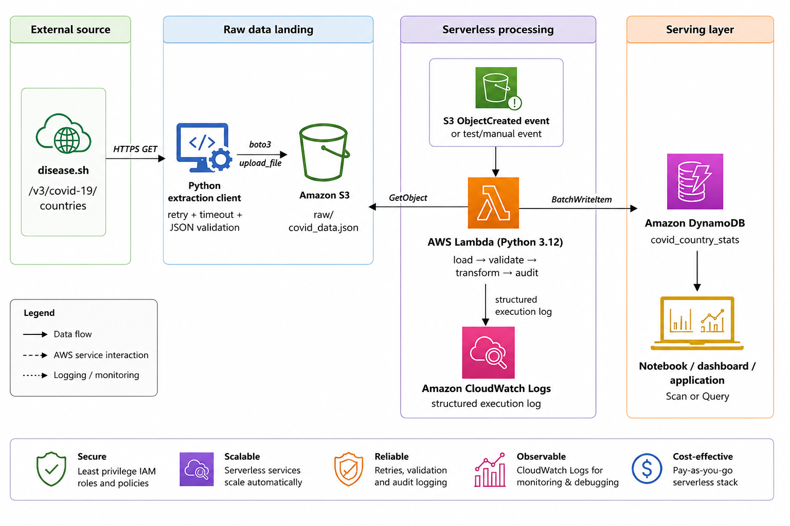

# 🦠 COVID-19 Serverless ETL Pipeline on AWS


## 📌 Overview

This project is a **serverless ETL pipeline** built on AWS that extracts COVID-19 country statistics from the **disease.sh API**, stores the raw JSON in Amazon S3, transforms the data using AWS Lambda, and loads the processed records into Amazon DynamoDB.

The project also includes a complete **CI/CD pipeline** using **GitHub Actions**, **AWS CodeBuild**, and **AWS CodePipeline** for automatic deployment.

---

# 🚀 Architecture



---

# ⚙️ ETL Workflow

```text
COVID-19 API
      │
      ▼
Python Extraction Script
      │
      ▼
Amazon S3 (Raw JSON)
      │
      ▼
AWS Lambda
      │
      ├── Validate Data
      ├── Transform Records
      ├── Calculate Risk Level
      └── Generate Audit Summary
      │
      ▼
Amazon DynamoDB
      │
      ▼
CloudWatch Logs
```

---

# ☁️ AWS Services Used

* Amazon S3
* AWS Lambda
* Amazon DynamoDB
* AWS IAM
* Amazon CloudWatch
* AWS CodeBuild
* AWS CodePipeline
* GitHub Actions

---

# 🛠️ Tech Stack

* Python 3.12
* Boto3
* Requests
* Pytest
* Git & GitHub
* AWS CLI

---

# 📂 Project Structure

```text
covid19-s3-lambda-dynamodb-etl/
│
├── extraction/
├── lambda/
├── tests/
├── screenshots/
├── iam/
├── .github/
├── buildspec.yml
├── architecture.png
├── README.md
└── requirements.txt
```

---

# 🔄 CI/CD Pipeline

The deployment is fully automated.

```text
Developer
    │
git push
    │
    ▼
GitHub
    │
    ▼
GitHub Actions
    │
    ▼
AWS CodePipeline
    │
    ▼
AWS CodeBuild
    │
    ▼
AWS Lambda Deployment
```

Every push to the **main** branch automatically triggers:

* Source download from GitHub
* Build using AWS CodeBuild
* Deployment to AWS Lambda

---

# 📊 DynamoDB Schema

| Attribute         | Type                   |
| ----------------- | ---------------------- |
| country           | String (Partition Key) |
| continent         | String                 |
| population        | Number                 |
| total_cases       | Number                 |
| active_cases      | Number                 |
| recovered         | Number                 |
| deaths            | Number                 |
| critical          | Number                 |
| cases_per_million | Number                 |
| risk_level        | String                 |
| processed_at_utc  | String                 |

---

# ▶️ Run Locally

Clone the repository

```bash
git clone https://github.com/Mayank830205/covid19-s3-lambda-dynamodb-etl.git

cd covid19-s3-lambda-dynamodb-etl
```

Install dependencies

```bash
pip install -r requirements.txt
```

Extract data

```bash
python extraction/extract_covid_data.py
```

Upload to Amazon S3

```bash
python extraction/upload_to_s3.py
```

Run tests

```bash
pytest
```

---

# 📸 Screenshots

Add screenshots for:

* GitHub Actions
* AWS CodePipeline
* AWS CodeBuild
* AWS Lambda
* Amazon S3
* DynamoDB
* CloudWatch Logs

---

# ✨ Features

* Serverless ETL Pipeline
* Automated Data Validation
* Data Transformation
* Risk Level Classification
* Batch Loading into DynamoDB
* CloudWatch Logging
* GitHub Actions CI
* AWS CodePipeline CD
* Automated Lambda Deployment

---

# 📈 Future Improvements

* AWS Glue Integration
* Amazon Athena Analytics
* EventBridge Scheduling
* SNS Notifications
* Terraform / AWS CDK
* Power BI Dashboard
* Historical Trend Analysis

---

# 👨‍💻 Author

**Mayank Shringi**

MCA | Data Engineering Enthusiast

GitHub: https://github.com/Mayank830205

---

# 📄 License

This project is licensed under the MIT License.
