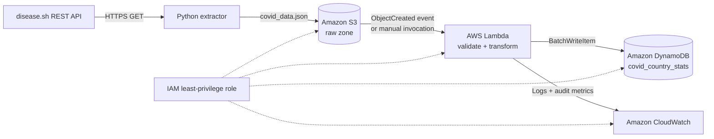

# 🦠 COVID-19 Serverless ETL on AWS

[](https://www.python.org/)
[](https://aws.amazon.com/lambda/)
[](https://pytest.org/)
[](https://peps.python.org/pep-0008/)

## Project Overview

`covid19-s3-lambda-dynamodb-etl` is a portfolio-ready, serverless data
engineering project. It extracts country-level COVID-19 statistics from the
[disease.sh API](https://disease.sh/v3/covid-19/countries), lands the immutable
raw JSON in Amazon S3, transforms it in AWS Lambda, and writes queryable,
country-grain records to Amazon DynamoDB.

The pipeline emphasizes clear module boundaries, deterministic transformations,
least-privilege IAM, structured logging, testability, and an audit summary for
every run.

## Business Problem

Public-health analysts and operational teams often need a lightweight global
view of country-level case activity without managing servers or databases. This
pipeline creates a low-maintenance serving layer that can support dashboards,
risk monitoring, scheduled reports, and ad hoc analysis.

## Architecture Diagram



See [architecture/architecture_diagram.md](architecture/architecture_diagram.md)
and [architecture/workflow.md](architecture/workflow.md) for the detailed
design.

## Dataset Source

- Endpoint: `https://disease.sh/v3/covid-19/countries`
- Authentication: none
- Grain: one source object per country or territory
- Raw landing path: `s3://<bucket>/raw/covid_data.json`

The source is a public API. Its values and availability are controlled by the
provider, so the extractor uses timeouts, retries, response validation, and
logging.

## AWS Services Used

| Service | Responsibility |
|---|---|
| Amazon S3 | Durable raw-data landing zone |
| AWS Lambda | Validation, transformation, and load orchestration |
| Amazon DynamoDB | Low-latency country-level serving table |
| AWS IAM | Least-privilege access control |
| Amazon CloudWatch | Lambda logs, failures, duration, and operational metrics |

## Folder Structure

```text
covid19-s3-lambda-dynamodb-etl/
├── architecture/           # Architecture diagram and workflow
├── data/
│   ├── raw/                # Generated source file (ignored by Git)
│   └── sample_output/      # Example Lambda audit response
├── docs/                   # Business and technical documentation
├── dynamodb/               # Table, GSI, and sample-item designs
├── extraction/             # API extraction and S3 upload scripts
├── iam/                    # Deployable IAM policy examples
├── lambda/                 # Lambda handler, transforms, and utilities
├── notebooks/              # DynamoDB scan/query analysis notebook
├── screenshots/            # Portfolio evidence placeholders
├── tests/                  # Pytest unit tests with AWS test doubles
├── .github/workflows/      # Python 3.12 continuous integration
├── .env.example
├── .gitignore
├── pytest.ini
├── README.md
└── requirements.txt
```

## ETL Flow

1. `extract_covid_data.py` calls the API and saves
   `data/raw/covid_data.json`.
2. `upload_to_s3.py` uploads the file as `raw/covid_data.json`.
3. Lambda reads the S3 object using environment configuration or the triggering
   S3 event.
4. Records without a country or positive population are rejected.
5. Valid rows are standardized, typed as `Decimal`, enriched with a risk level
   and UTC processing timestamp, then batch-written to DynamoDB.
6. Lambda returns and logs an audit summary with source, target, input, clean,
   rejected, and inserted counts.

## DynamoDB Schema

Table: `covid_country_stats`

| Attribute | DynamoDB type | Description |
|---|---:|---|
| `country` | S | Uppercase partition key |
| `continent` | S | Source continent, or `UNKNOWN` |
| `population` | N | Country population |
| `total_cases` | N | Cumulative reported cases |
| `active_cases` | N | Current active cases |
| `recovered` | N | Cumulative recovered cases |
| `deaths` | N | Cumulative deaths |
| `critical` | N | Current critical cases |
| `cases_per_million` | N | Normalized cumulative cases |
| `risk_level` | S | `LOW`, `MEDIUM`, or `HIGH` |
| `processed_at_utc` | S | ISO 8601 pipeline timestamp |

The single-country partition key makes each run an idempotent snapshot: a later
write replaces that country's prior item. A proposed analytical GSI is described
in [dynamodb/gsi_design.md](dynamodb/gsi_design.md).

## Transformation Logic

```text
Reject when country is blank or population <= 0
country = trim(country).upper()
all numeric attributes = Decimal(value)

active_cases >= 100000  -> HIGH
active_cases >= 10000   -> MEDIUM
otherwise               -> LOW

processed_at_utc = one UTC timestamp shared by the run
```

See [docs/transformations.md](docs/transformations.md) for field-level details.

## Local Setup and Execution

Prerequisites: Python 3.12, AWS credentials configured through a standard AWS
credential provider, an S3 bucket, and the DynamoDB table.

```bash
python -m venv .venv
source .venv/bin/activate
pip install -r requirements.txt

python extraction/extract_covid_data.py
BUCKET_NAME=my-bucket python extraction/upload_to_s3.py
pytest
```

On Windows PowerShell, activate with `.venv\Scripts\Activate.ps1` and set an
environment variable with `$env:BUCKET_NAME = "my-bucket"`.

No credentials are accepted in source code or `.env.example`. Use an IAM role
in AWS and an AWS CLI profile or environment-based credential provider locally.

## AWS Deployment Notes

1. Create an S3 bucket and a DynamoDB table with string partition key
   `country`.
2. Create the Lambda execution role from a policy in `iam/`, replacing the
   example region, account ID, bucket, function, and table values.
3. Package the contents of `lambda/` at the ZIP root and configure
   `lambda_function.lambda_handler` on the Python 3.12 runtime.
4. Set `BUCKET_NAME`, `OBJECT_KEY`, and `TABLE_NAME` Lambda environment
   variables.
5. Optionally add an S3 `ObjectCreated` notification filtered to
   `raw/covid_data.json`.
6. Use a timeout of at least 30 seconds and begin with 256 MB memory; tune from
   CloudWatch duration and memory metrics.

## IAM Permissions

The Lambda role grants:

- `s3:GetObject` on the raw source object or prefix
- `dynamodb:PutItem` and `dynamodb:BatchWriteItem` on the target table
- `logs:CreateLogGroup`, `logs:CreateLogStream`, and `logs:PutLogEvents`

It intentionally omits bucket listing, deletion, table administration, scans,
and wildcard data-plane permissions. See [iam/](iam/).

## Sample Lambda Output

```json
{
  "source_file": "s3://portfolio-covid-data/raw/covid_data.json",
  "target_table": "covid_country_stats",
  "input_records": 231,
  "clean_records": 229,
  "rejected_records": 2,
  "inserted_records": 229,
  "processed_at_utc": "2026-01-01T00:00:00+00:00"
}
```

## Screenshots

Add deployment evidence to `screenshots/`, such as:

- S3 raw object
- Lambda environment and successful test result
- DynamoDB table items
- CloudWatch execution logs
- Notebook output

The directory includes a checklist that avoids committing account IDs,
credentials, or other sensitive information.

## Future Enhancements

- Provision all resources with AWS SAM, CDK, or Terraform
- Schedule extraction with EventBridge or run it in Lambda
- Add S3 versioning, checksums, and date-partitioned immutable keys
- Store rejects in an S3 quarantine prefix with rejection reasons
- Publish custom CloudWatch metrics and alarms for rejection/failure rates
- Add DynamoDB point-in-time recovery and optional risk-level GSI
- Extend the included test workflow with linting and dependency scanning
- Introduce historical snapshots for trend analysis

## Author

**Mayank Shringi** — Data Engineering Portfolio Project
