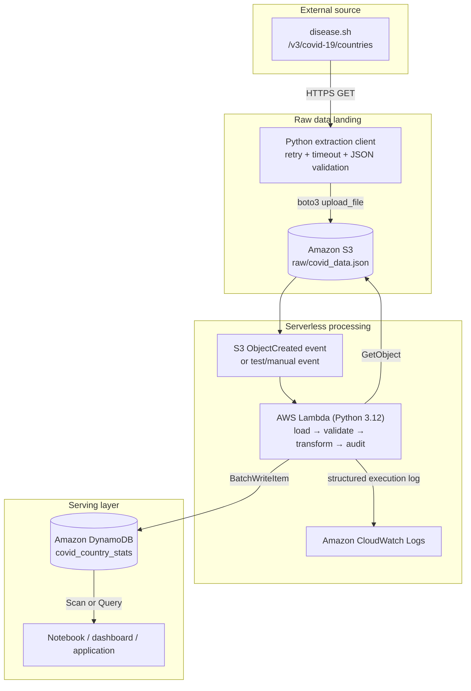

# Architecture Diagram

## Trust boundaries

- The public API is untrusted input. The extractor verifies HTTP success and
  response shape; Lambda validates every record before writing.
- S3 is the durable hand-off between extraction and transformation.
- Lambda receives AWS access only from its execution role.
- DynamoDB is not public and is accessed through IAM-authenticated AWS APIs.
- CloudWatch receives execution metadata and counts, not credentials.

## Reliability properties

- API requests use timeouts and bounded retries for transient status codes.
- Raw data is stored before transformation, making a run replayable.
- DynamoDB `batch_writer()` retries unprocessed writes.
- `overwrite_by_pkeys=["country"]` collapses duplicate country writes in a
  batch and supports snapshot-style idempotency.
- A single `processed_at_utc` value identifies every item written in one run.

